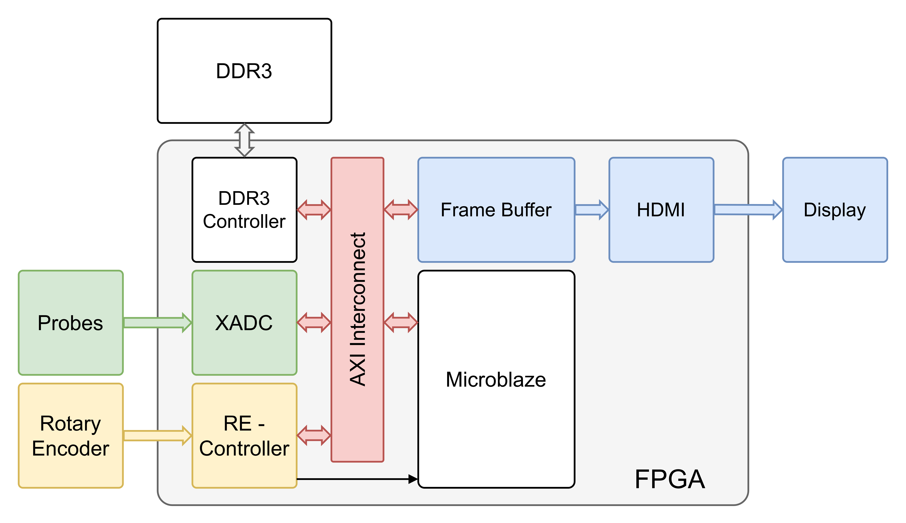
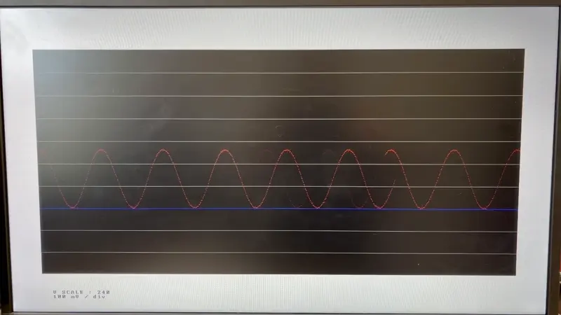

# Oscilloscope on FPGA

## Internal diagram

## Demo

## Repository organisation 

- `build` : Built elf, bitstream and xsa
- `docs` : Documentation

- `src.bd` : Block diagrams
- `src.constraints` : Constraint files
- `src.cpu` : The C code that goes on the Softcore CPU
- `src.framebuffer` : Individual framebuffer code
- `src.rotary_encoder` : Individual rotary_encoder code
- `src.video_generator` : Individual video_generator code

[FULL VIDEO DEMO](docs/IMG_0708.mov)
